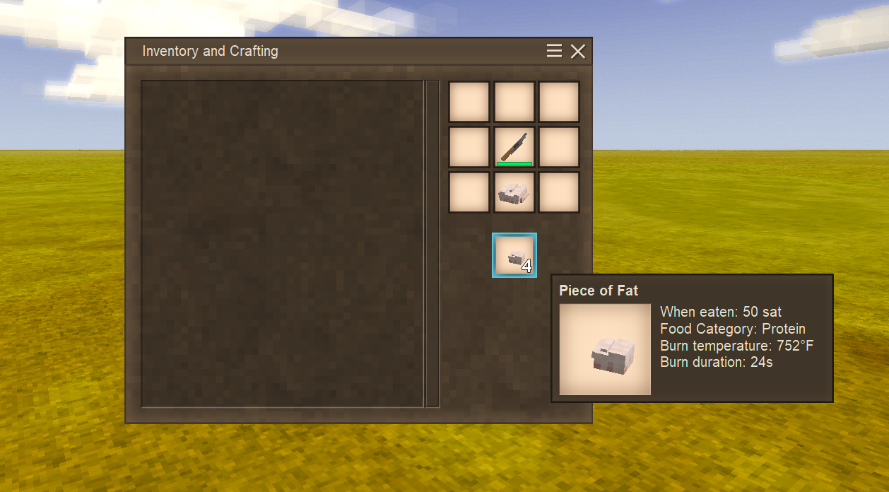
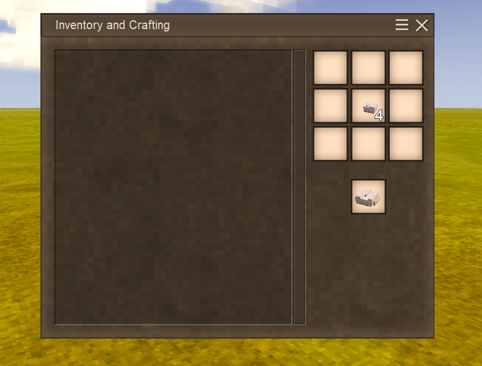
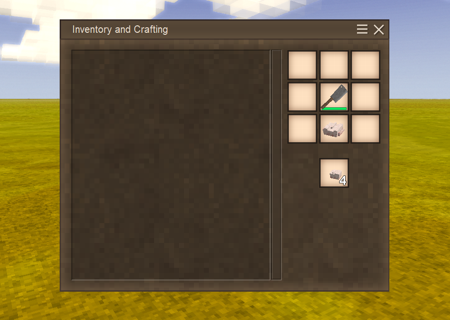
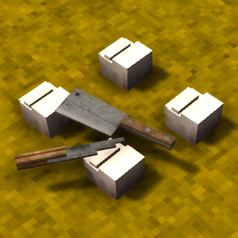

# Combine The Fat

A Vintage Story mod that patches in the ability to recombine fat pieces from the "Cut The Fat" mod.

## Description

This mod works as a companion to the "Cut The Fat" mod, allowing players to reverse the fat cutting process. While "Cut The Fat" lets you slice fat into smaller pieces, "Combine The Fat" adds recipes to recombine those cut pieces back into whole fat blocks.

## Features

- **Recombine Fat Pieces**: Craft 4 fat-cut pieces back into 1 whole fat item using a 2x2 crafting pattern
- **Improved Fat Cutting**: Updates the fat cutting recipe to yield 4 fat-cut pieces (instead of the default amount)
- **Shapeless Crafting**: The recombining recipe works in any 2x2 arrangement - no specific pattern required

## Screenshots

## Installation

1. Download the mod file
2. Place it in your Vintage Story `Mods` folder
3. Ensure you have the "Cut The Fat" mod installed (required dependency)
4. Launch Vintage Story

## Requirements

- **Vintage Story** (compatible version)
- **Cut The Fat mod** (required dependency)

## Technical Details

This mod uses JSON patches to modify the existing fat cutting recipes:
- Adds a new recipe to combine 4 `fat-cut` items into 1 `fat` item
- Modifies the original fat cutting recipe output to provide 4 pieces

## Author

**CircuitPwne**

## Repository

[GitHub Repository](https://github.com/CircuitDev192/CombineTheFat)

## Version

1.0.0

## License

This mod is created for the Vintage Story community. Please check the repository for license details.